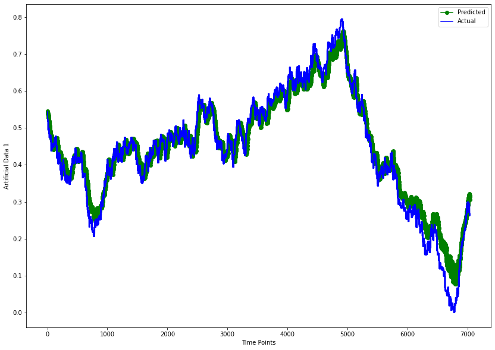

# Time Series Prediction with Recurrent Neural Networks (RNN)


**Time Series Prediction with Recurrent Neural Networks (RNN)**<br>
Minh Khoi Nguyen Do, Vuong Ho, Chuqin Wu, Qianwen Fu<br>

### [Project Page](https://github.com/goodudetheboy/TimeSeriesWithNN) | [Paper](./paper/paper.pdf) | [Data](#dataset)<br>

Abstract: *We look to apply deep learning techniques in the subject of time series analysis and analyze their performance in this type of task, and possibly compare their accuracy against autoregressive methods, which are algorithms specially developed for time series data. Specifically, we look at whether neural networks can be applied in the financial sectors by using a variety of networks such as bidirectional RNN, GRU, and LSTM to predict future prices of Microsoft stocks, Bitcoin, and similar datasets with varying levels of features. We have also prepared and generated artificial time series datasets that simulate reality to see how deep learning can be applied in this kind of task. We find that all four of the networks we experimented with perform relatively well on our datasets and that some networks perform better at one dataset than the other.*

This project was done as part of Fall 2021 CSC 240 Data Mining @ the University of Rochester.

# Requirements
The codebase is tested on 
* Python 3.8
* PyTorch 1.7.1

External libraries:
- [pandas](https://pandas.pydata.org/) (fast, powerful, flexible and easy to use open source data analysis and manipulation tool)
- [PyTorch](https://pytorch.org/) (An open source deep learning platform) 
- [scikit-learn](https://scikit-learn.org/) (Machine Learning in Python)

# Table Of Contents
-  [Dataset](#dataset)
-  [In Details](#in-details)
-  [Future Work](#future-work)
-  [Contributing](#contributing)
-  [Acknowledgments](#acknowledgments)

# Dataset   
For this project, we used 6 datasets, 4 real-world datasets including 
- [Microsoft stock price](https://www.kaggle.com/vijayvvenkitesh/microsoft-stock-time-series-analysis) (Stock market)
- [S&P500 Index](https://datahub.io/core/s-and-p-500) (Stock market)
- [Crude oil prices](https://fred.stlouisfed.org/series/DCOILBRENTEU) (Natural resources)
- [Bitcoin price](https://www.kaggle.com/sudalairajkumar/cryptocurrencypricehistory) (Cryptocurrency)

along with 2 artificially generated datasets.

## Artificical dataset generation 
To generate an artificial time-series dataset, we
first used the Pandas package to create a dataframe ranging
from 2000-01-01 to 2021-12-31, and random numbers generated
by Numpy were assigned to the dataframe. Then, the
seasonal decomposition method from statsmodels package
was applied to the dataframe with a period of 365 days,
resulting in trend, seasonality, and residual. The trend was
calculated by moving average with a window length of 365,
so the first half-year and the last half year will disappear. We
extracted the trend data as our final artificial dataset since it
is more similar to the normal financial time-series data. A
total of 7307 timesteps was generated.

The following figure displays an example of our algorithm in action.



# In Details
```
├──  config
│    └── defaults.py  - here's the default config file.
│
│
├──  configs  
│    └── train_mnist_softmax.yml  - here's the specific config file for specific model or dataset.
│ 
│
├──  data  
│    └── datasets  - here's the datasets folder that is responsible for all data handling.
│    └── transforms  - here's the data preprocess folder that is responsible for all data augmentation.
│    └── build.py  		   - here's the file to make dataloader.
│    └── collate_batch.py   - here's the file that is responsible for merges a list of samples to form a mini-batch.
│
│
├──  engine
│   ├── trainer.py     - this file contains the train loops.
│   └── inference.py   - this file contains the inference process.
│
│
├── layers              - this folder contains any customed layers of your project.
│   └── conv_layer.py
│
│
├── modeling            - this folder contains any model of your project.
│   └── example_model.py
│
│
├── solver             - this folder contains optimizer of your project.
│   └── build.py
│   └── lr_scheduler.py
│   
│ 
├──  tools                - here's the train/test model of your project.
│    └── train_net.py  - here's an example of train model that is responsible for the whole pipeline.
│ 
│ 
└── utils
│    ├── logger.py
│    └── any_other_utils_you_need
│ 
│ 
└── tests					- this foler contains unit test of your project.
     ├── test_data_sampler.py
```


# Future Work

# Contributing
Any kind of enhancement or contribution is welcomed.


# Acknowledgments


