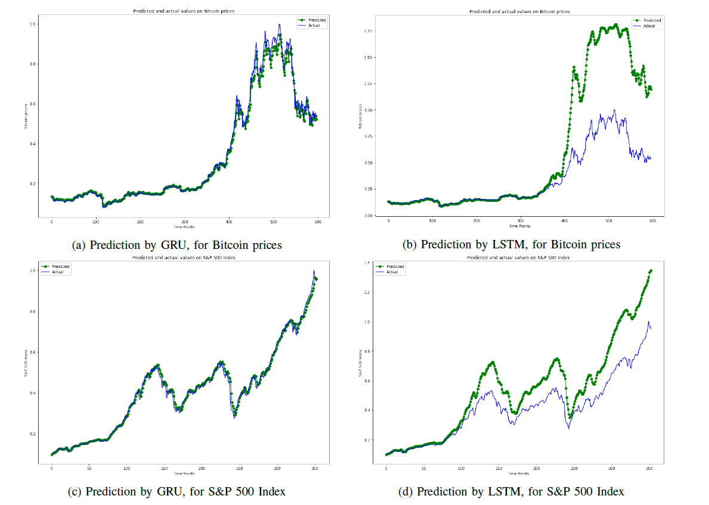

# Time Series Prediction with Recurrent Neural Networks (RNN)



**Time Series Prediction with Recurrent Neural Networks (RNN)**<br>
[Minh Khoi Nguyen Do](https://github.com/DiningSystem), [Vuong Ho](https://github.com/goodudetheboy), [Chuqin Wu](https://github.com/chuqinwu), [Qianwen Fu](https://github.com/qfu4)<br>

### [Project Page](https://github.com/goodudetheboy/TimeSeriesWithNN) | [Paper](./paper/paper.pdf) | [Data](#dataset)<br>

Abstract: *We look to apply deep learning techniques in the subject of time series analysis and analyze their performance in this type of task, and possibly compare their accuracy against autoregressive methods, which are algorithms specially developed for time series data. Specifically, we look at whether neural networks can be applied in the financial sectors by using a variety of networks such as bidirectional RNN, GRU, and LSTM to predict future prices of Microsoft stocks, Bitcoin, and similar datasets with varying levels of features. We have also prepared and generated artificial time series datasets that simulate reality to see how deep learning can be applied in this kind of task. We find that all four of the networks we experimented with perform relatively well on our datasets and that some networks perform better at one dataset than the other.* 

This project was done as part of Fall 2021 CSC 240 Data Mining @ the University of Rochester.

# Requirements
The codebase is tested on 
* Python 3.8
* PyTorch 1.7.1

External libraries:
- [pandas](https://pandas.pydata.org/) (fast, powerful, flexible and easy to use open source data analysis and manipulation tool)
- [PyTorch](https://pytorch.org/) (An open source deep learning platform) 
- [scikit-learn](https://scikit-learn.org/) (Machine Learning in Python)

# Table Of Contents
-  [Dataset](#dataset)
-  [Models](#models)
-  [Run the demo](#run-the-demo)
-  [In Details](#in-details)
-  [Contributing](#contributing)
-  [Citation](#citation)
-  [License](#license)

# Dataset   
For this project, we used 6 datasets, 4 real-world datasets including 
- [Microsoft stock price](https://www.kaggle.com/vijayvvenkitesh/microsoft-stock-time-series-analysis) (Stock market)
- [S&P500 Index](https://datahub.io/core/s-and-p-500) (Stock market)
- [Crude oil prices](https://fred.stlouisfed.org/series/DCOILBRENTEU) (Natural resources)
- [Bitcoin price](https://www.kaggle.com/sudalairajkumar/cryptocurrencypricehistory) (Cryptocurrency)

along with 2 artificially generated datasets. Note that we have already generated and put them in [dataset](./dataset/) directory along with the other real-world datasets.

## Artificical dataset generation 
To generate an artificial time-series dataset, we
first used the Pandas package to create a dataframe ranging
from 2000-01-01 to 2021-12-31, and random numbers generated
by Numpy were assigned to the dataframe. Then, the
seasonal decomposition method from statsmodels package
was applied to the dataframe with a period of 365 days,
resulting in trend, seasonality, and residual. The trend was
calculated by moving average with a window length of 365,
so the first half-year and the last half year will disappear. We
extracted the trend data as our final artificial dataset since it
is more similar to the normal financial time-series data. A
total of 7307 timesteps was generated.

The following figure displays an example of our algorithm in action.


# Models
We use 4 deep learning models for our analysis here:
- [Traditional RNN](https://arxiv.org/abs/1808.03314)
- [Bidirectional RNN](https://ieeexplore.ieee.org/document/650093)
- [Gated Recurrent Unit](https://arxiv.org/abs/1409.1259) (GRU)
- [Long Short-Term Memory](https://www.researchgate.net/publication/13853244_Long_Short-term_Memory) (LSTM)

These model implementation are also available in [main.ipynb](./src/model/main.ipynb), along with the training driver file. Although we did not separate them into `.py` file, it can easily be extracted from the appropriate section of the [main.ipynb](./src/model/main.ipynb) notebook.

# Run the demo

Navigate to [main.ipynb](./src/model/main.ipynb) (the main notebook), install the appropriate libraries, and run the notebook. Everything should be printed out along with metadata of the training.


# In Details
```
├── README.md
├── dataset                 - Contains datasets, which will be used by the main file
│   ├── Artificial_trend.csv
│   ├── Artificial_trend1.csv
│   ├── coin.csv
│   ├── microsoft.csv
│   ├── oil.csv
│   └── sp500.csv
├── docs
│   └── *                   - For this README
├── paper                   - Main paper along with source tex file
│   ├── **                  
│   └── paper.pdf           - Final paper
├── prospectus         
│   └── **
└── src
    ├── analysis                                - Analysis of dataset
    │   ├── Artificial_data_analysis.ipynb
    │   ├── Bitcoin_Oil_data_analysis.ipynb
    │   └── Microsoft_SP500_data_analysis.ipynb
    ├── datagen                                 - Algorithmic generation of dataset
    │   ├── Artificial_series_1.ipynb
    │   └── Artificial_trend.csv
    └── model
        ├── implementation  - Core implementation of RNN models
        │   ├── GRU.ipynb
        │   ├── LSTM_wu.ipynb
        │   ├── biRNN.ipynb
        │   └── simple RNN.ipynb
        ├── main.ipynb      - Main notebook, this is where all the magic happens
        └── train.py        - Training driver
```

# Contributing
Any kind of enhancement or contribution is welcomed.

# Citation
Any kind of enhancement or contribution is welcomed.
```
@unpublished{
    mkvhcwcfu2021,
    title={Time Series Prediction with Recurrent Neural Networks (RNN)},
    author={Minh Khoi Nguyen Do, Vuong Ho, Chuqin Wu, and Qianwen Fu},
    booktitle={International Conference on Learning Representations},
    year={2021},
    url={https://github.com/goodudetheboy/TimeSeriesWithNN}
}
```

# License
MIT License

Copyright (c) 2021 Vuong Ho, Minh Khoi Nguyen Do, Chuqin Wu, Qianwen Fu

Permission is hereby granted, free of charge, to any person obtaining a copy
of this software and associated documentation files (the "Software"), to deal
in the Software without restriction, including without limitation the rights
to use, copy, modify, merge, publish, distribute, sublicense, and/or sell
copies of the Software, and to permit persons to whom the Software is
furnished to do so, subject to the following conditions:

The above copyright notice and this permission notice shall be included in all
copies or substantial portions of the Software.

THE SOFTWARE IS PROVIDED "AS IS", WITHOUT WARRANTY OF ANY KIND, EXPRESS OR
IMPLIED, INCLUDING BUT NOT LIMITED TO THE WARRANTIES OF MERCHANTABILITY,
FITNESS FOR A PARTICULAR PURPOSE AND NONINFRINGEMENT. IN NO EVENT SHALL THE
AUTHORS OR COPYRIGHT HOLDERS BE LIABLE FOR ANY CLAIM, DAMAGES OR OTHER
LIABILITY, WHETHER IN AN ACTION OF CONTRACT, TORT OR OTHERWISE, ARISING FROM,
OUT OF OR IN CONNECTION WITH THE SOFTWARE OR THE USE OR OTHER DEALINGS IN THE
SOFTWARE.
